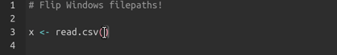

# `winflip` Addin Utility

Filepath backslashed are a ubiquitous lament of R users forced to work on Windows. Often, network drives are too slow - or the volume of files too great - to use tab-completion effectively. For many, copying a file path from Windows explorer is their best option for reading data into R. `winflip` is an RStudio Addin that - when mapped to a hotkey - will flip backslashes in highlighted text into something R-friendly:

If you are new to RStudio Addins, please refer to [this documentation](https://towardsdatascience.com/rstudio-addins-or-how-to-make-your-coding-life-easier-6b627c7b2240). The basic process to install it is:

1. Install the package with `devtools::install_github("jacksonvoelkel/winflip")`
2. Under *Tools \> Modify Keyboard Shortcuts* add a custom binding of your choice to "Flip Backslashes"
